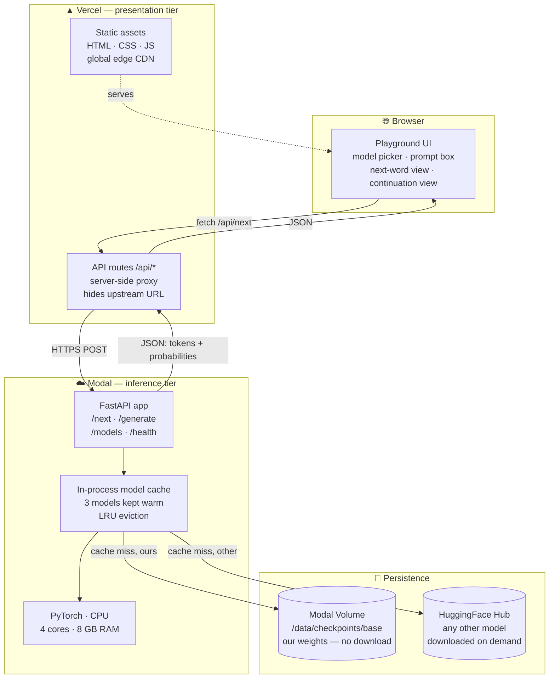
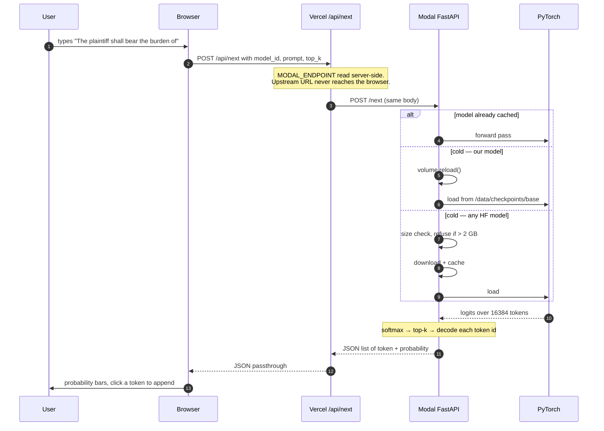

# Chapter 13 — Serving the Model: From Weights to a Website

## In plain terms

Publishing to HuggingFace (Chapter 12) does not give you a working product. It gives you a
**file**. `model.safetensors` is 250 MB of numbers sitting in a repository. Nobody can type a
sentence into it.

Turning that file into something a person can use needs three separate things, and the
interesting part of this chapter is that **they cannot all live in the same place**:

1. Something must hold the weights **in memory** and run the arithmetic. That needs PyTorch,
   several gigabytes of RAM, and a process that stays alive.
2. Something must expose that over **HTTP** so a browser can reach it.
3. Something must give a human a **user interface**.

The instinct is to put all three on Vercel. That is impossible, and understanding *why* is the
single most useful thing in this chapter.

### The constraint that shapes everything

Vercel runs your code as serverless functions, which have a hard size limit of roughly
**250 MB unzipped**. Here is what we would need to fit into it:

| Thing | Size |
|---|---|
| PyTorch (CPU build, with dependencies) | ~800 MB – 2.5 GB |
| transformers + tokenizers | ~150 MB |
| The model weights | ~250 MB |
| **Total** | **~1.2 – 2.9 GB** |
| **Vercel's limit** | **250 MB** |

It is not close. No amount of pruning fixes a 5–12× overshoot. Serverless platforms are built
for functions that start in milliseconds and hold no state; a language model is the exact
opposite — slow to start, and useless unless it stays resident in memory.

So the work splits across two platforms, each doing what it is actually good at:

- **Vercel** serves the user interface — static assets on a global CDN, which is precisely
  what it excels at.
- **Modal** holds the model in memory and does the arithmetic — a long-lived container with
  real RAM, which is precisely what *it* excels at.

---

## The High Level Design



Three tiers, each with one job:

| Tier | Platform | Responsibility | Scales by |
|---|---|---|---|
| Presentation | Vercel CDN | HTML/CSS/JS to the browser | Edge replication, effectively free |
| Gateway | Vercel functions | Proxy, hide upstream, future rate limiting | Per request, milliseconds |
| Inference | Modal container | Hold weights, run forward passes | Container count, scale-to-zero |

---

## How a single request actually flows



Steps 4–8 are the only part that touches a GPU-shaped workload, and it runs on **CPU** —
a 125M model does not need a GPU for single-request inference, which matters enormously for
cost (see below).

---

## Why the proxy tier exists

The browser could call Modal directly. We deliberately route through `/api/*` on Vercel
instead, for four reasons:

1. **No CORS.** Same-origin requests need no preflight, no `Access-Control-*` headers, and no
   class of bug that only appears in production.
2. **The upstream URL stays server-side.** `MODAL_ENDPOINT` is read in the Node runtime and
   never shipped to the client. Someone reading our JavaScript cannot find the inference
   endpoint to hammer.
3. **One place to add controls.** Rate limiting, an API key, request logging, or an allowlist
   all belong at a single chokepoint. Scattering them is how they get forgotten.
4. **The backend can be replaced without touching the frontend.** Swap Modal for a GPU host,
   or vLLM, or a managed API — the UI never learns about it.

```js
// app/api/_upstream.js — the entire gateway
export const UPSTREAM = process.env.MODAL_ENDPOINT || "https://…modal.run";

export async function proxy(path, body) {
  const res = await fetch(`${UPSTREAM}${path}`, {
    method: body ? "POST" : "GET",
    headers: { "Content-Type": "application/json" },
    body: body ? JSON.stringify(body) : undefined,
    signal: AbortSignal.timeout(120000),   // a cold container must load a model
  });
  …
}
```

The 120-second timeout is not arbitrary. Vercel functions default to 10 seconds; a cold Modal
container downloading a model can exceed that. The route declares `maxDuration = 60` and the
fetch allows longer, so a slow cold start surfaces as a slow response rather than a confusing
gateway timeout.

---

## Cold starts, and scale-to-zero

The inference container is configured `scaledown_window=300` — it idles out after five
minutes with no traffic. That is the entire cost strategy: **you pay for seconds of use, and
nothing at rest.**

The price is a cold start. Measured:

| State | What happens | Observed |
|---|---|---|
| Warm | Model in RAM, straight to forward pass | ~1.1 s round trip |
| Cold, our model | Container boot + read from Volume | ~9 s |
| Cold, new HF model | Container boot + size check + download + load | 10–40 s |

Our own model is read from the Modal Volume where Phase 5 wrote it, so it is never downloaded
from the internet at all. Three models stay resident per container with LRU eviction; a fourth
evicts the least recently used.

The UI states this plainly rather than appearing to hang: *"the first request after an idle
period takes a few seconds while the container wakes."* Honest latency messaging is cheaper
than a spinner that makes users think the thing is broken.

---

## Making the model configurable

The requirement was to select **any** model, not just ours. That is one function:

```python
def load(model_id: str):
    if model_id in cache:
        return cache[model_id]
    if model_id == LOCAL_ALIAS:          # ours — straight off the Volume
        volume.reload()
        path = config.BASE_CKPT_DIR
    else:                                # anything on the Hub
        check_size(model_id)             # refuse > 2 GB before downloading
        path = model_id
    …
```

`check_size` queries the HuggingFace API for file metadata *before* downloading, so an
oversized request is rejected in milliseconds rather than after a multi-gigabyte transfer:

```
$ curl -X POST …/next -d '{"model_id":"meta-llama/Llama-2-7b-hf","prompt":"hi"}'
{"detail":"'meta-llama/Llama-2-7b-hf' is 27.0 GB; this demo caps models at 2.0 GB"}
```

This guard is load-bearing. Without it, one request for a 70B model would exhaust the
container's disk and memory and take the service down for everyone.

---

## The latency budget

Measured against the live endpoint from a client in India (so network round-trip is a large,
honest component):

| Operation | Wall clock | Of which compute |
|---|---|---|
| Round-trip floor (network + FastAPI + 1 forward pass) | **1,055 ms** | ~100 ms |
| `POST /next`, top-k 10 | ~1,080 ms | ~30 ms |
| `POST /generate`, 20 tokens | 1,655 ms | 600 ms |
| `POST /generate`, 60 tokens | 2,563 ms | 1,508 ms |
| `POST /generate`, 120 tokens | 4,008 ms | 2,953 ms |
| `POST /generate`, 200 tokens | 6,110 ms | 5,055 ms |

Generation costs a steady **~25 ms per token** on 4 CPU cores. Note that the round-trip floor
of ~1 second *dominates* next-word prediction — the actual model forward pass is around 30 ms.
For this workload the network, not the model, is the bottleneck. Moving the container to a
region nearer the user would help far more than any model optimisation.

### A real bug this measurement exposed

The first latency run showed something wrong:

| Tokens | ms/token |
|---|---|
| 60 | 77 |
| 200 | **162** |

Per-token cost should be *flat*. Doubling as the sequence grows is the signature of
**quadratic** generation — each new token re-running the forward pass over the entire sequence
instead of reusing cached attention keys and values.

The cause was in `config.json`, and it came from training:

```json
"use_cache": false
```

That is **correct for training** — the KV cache is useless when you process a whole batch of
fixed-length windows at once, and it wastes memory. It is **badly wrong for inference**, where
it is the difference between O(n) and O(n²) generation. The setting was published to
HuggingFace along with the weights, and every consumer inherits it.

One line at load time:

```python
model.config.use_cache = True          # config.json says False — that is a TRAINING setting
```

| Tokens | Before | After | Speedup |
|---|---|---|---|
| 60 | 77 ms/tok | 25.1 ms/tok | 3.1× |
| 200 | 162 ms/tok | **25.3 ms/tok** | **6.4×** |

And per-token cost is now flat across 20/60/120/200 tokens, which is what a correct
implementation looks like. **Check this on any model you serve** — it is invisible at short
lengths and severe at long ones.

---

## What it costs to run

Inference is CPU-only: 4 cores and 8 GB RAM, at Modal's `$0.047/core-hr` and
`$0.008/GiB-hr`.

$$4 \times 0.047 + 8 \times 0.008 = \$0.252\ \text{per container-hour}$$

But you are only billed while a container is alive, and it idles out after five minutes:

| Usage pattern | Container-hours/day | Cost/day | Cost/month |
|---|---|---|---|
| Idle | 0 | $0 | **$0** |
| A demo: 20 min of clicking | ~0.4 | $0.10 | — |
| A class of 30, one hour | ~1.5 (with concurrency) | $0.38 | — |
| Continuous 8h/day, 30 days | 240 | $60 | $60 |

Vercel's hosting sits inside the Hobby free tier for this traffic level.

The alternative worth pricing: serving on an H100 at $3.949/hr would cost **16× more per
hour** and be no faster for single requests, because a 125M model does not saturate a GPU.
GPUs win on *throughput under concurrent load*, not on latency for one small model. **Serve
small models on CPU.**

---

## Alternatives we considered and rejected

| Approach | Why not |
|---|---|
| **Model inside Vercel functions** | Physically impossible — 1.2–2.9 GB against a 250 MB limit. |
| **transformers.js in the browser** | Genuinely attractive: zero inference cost, no cold starts, complete privacy. Rejected because it requires ONNX conversion of every model, which would have broken the "select **any** HuggingFace model" requirement — the user could only pick from models someone had already converted. |
| **HuggingFace Inference API** | Serverless inference does not reliably host arbitrary custom small models, and we would be depending on someone else's availability for the one model that is entirely ours. |
| **GPU serving (vLLM, TGI)** | Correct at scale; 16× the cost and no latency benefit at 125M and single-request traffic. Revisit above ~1B parameters or with real concurrency. |
| **A always-on VM** | Simple, but pays 24/7 for a service used minutes per day. Scale-to-zero is strictly better here. |

---

## Two deployments, deliberately

There are two working URLs, and this is not redundancy by accident:

```
https://anand-haridas--slm125mlive-anand-serve-web.modal.run     ← Modal, public
https://web-3balveir8-anand-7360s-projects.vercel.app            ← Vercel, SSO-protected
```

The Modal service serves a **complete self-contained playground at `/`** — one HTML file with
inline CSS and JS, no build step, no framework, no second platform. It exists because it
removes an entire class of failure: if Vercel is misconfigured, rate-limited, or the account
is locked, the model is still usable.

The Vercel deployment is the better long-term home — CDN-backed, a real framework, room to
grow — but it is a *presentation* improvement layered on a service that already worked
standalone. Building the fallback first turned out to be the right order: when Vercel blocked
the first deploy over a Next.js CVE and then gated the site behind SSO, there was still
something working to hand over.

---

## Security posture, honestly stated

What is protected:

- **The upstream URL** is server-side only in the Vercel path.
- **Model size** is capped at 2 GB, checked before download.
- **Prompt length** capped at 4,000 characters; `max_new_tokens` at 200; `top_k` at 50.
  All clamped server-side, so a hand-crafted request cannot exceed them.
- **Container count** capped at 4, bounding worst-case spend.
- **The Vercel deployment** currently requires Vercel SSO, so only the account owner can reach it.

What is **not** protected, and should be before this is shared widely:

- **There is no rate limiting.** The Modal endpoint is public and unauthenticated. Anyone who
  finds the URL can drive requests, and each one costs money. The cap of 4 containers bounds
  the damage but does not prevent it.
- **There is no authentication** on the Modal service at all. The proxy hides the URL from
  casual readers; it does not secure it.
- **Arbitrary model loading is a supply-chain surface.** `AutoModelForCausalLM.from_pretrained`
  on a user-supplied id will execute repository code if `trust_remote_code` is ever enabled.
  It is off, which is what makes this acceptable — but it is one flag away from remote code
  execution, and that flag should never be turned on for user input.

The honest summary: this is correctly built for a demo and a teaching artefact, and it needs a
rate limiter and a shared secret before it is linked publicly.

---

## What we measured

| Property | Value |
|---|---|
| Presentation tier | Vercel, Next.js 16.3.2, 3 dynamic routes + 1 static |
| Inference tier | Modal, FastAPI, 4 CPU cores, 8 GB RAM, max 4 containers |
| Standalone playground page | 8,867 bytes, single file, zero dependencies |
| Round-trip floor | 1,055 ms (network-dominated) |
| Next-word compute | ~30 ms |
| Generation | 25 ms/token, flat across 20–200 tokens |
| Cold start, our model | ~9 s (from Volume, no download) |
| Cold start, new HF model | 10–40 s (download + load) |
| Models kept warm | 3, LRU |
| Model size cap | 2 GB, checked pre-download |
| Cost at rest | **$0** |
| Cost per active container-hour | $0.252 |
| KV cache fix | 6.4× faster generation at 200 tokens |

---

## Recommendations

1. **Never try to run a model inside a serverless function.** The size limits make it
   impossible; separate presentation from inference from the start.
2. **Proxy through your own backend** rather than calling the inference host from the browser.
   It removes CORS, hides the upstream, and gives you one place to add controls.
3. **Set `use_cache = True` at inference load time**, regardless of what `config.json` says.
   Training configs disable it, publishing bakes that in, and it silently makes generation
   quadratic.
4. **Serve small models on CPU.** A GPU costs ~16× more and is no faster for single requests
   below roughly 1B parameters.
5. **Use scale-to-zero and tell users about the cold start.** Honest latency messaging beats a
   spinner that reads as a hang.
6. **Validate model size before downloading, not after.** One unbounded request otherwise
   takes down the service.
7. **Clamp every user-supplied parameter server-side.** Client-side limits are advisory.
8. **Ship a dependency-free fallback UI from the inference host itself.** Ours saved the
   demo twice while the frontend platform was blocked.
9. **Add rate limiting before you share the URL.** We have not, and the chapter says so.

---

*Next: [Chapter 14 — Everything That Broke](14-failures.md)*
